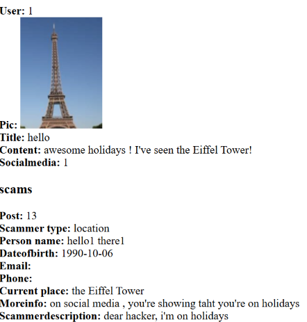
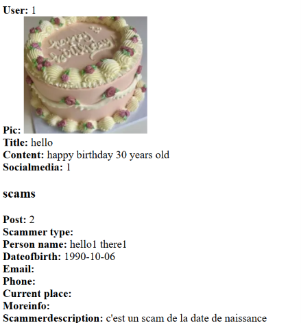

# birthday-scammer-app

Enter your first name, your photo (or a generic cake photo), your date of birth, the social network where you want to post, and the age being celebrated, and it generates the post for the selected social network
- if "happy birthday" in post:
- Scam.create(person_name: post.character.name, dateofbirth: post.created_at.todate)
  -  if "happy birthday" in post and post.created_at.to_date.month == post.character.dateofbirth.month and post.created_at.to_date.date == post.character.dateofbirth.date:
  -  Scam.create(person_name: post.character.name)
- phonenumber = (/regexphonenumber/)
- if regex.scan(phonenumber) in post:
- etc.
- fais python -m spacy download en_core_web_sm
- fais python -m spacy download fr_core_web_sm
